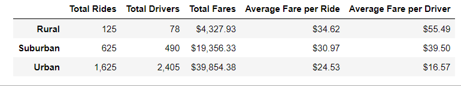
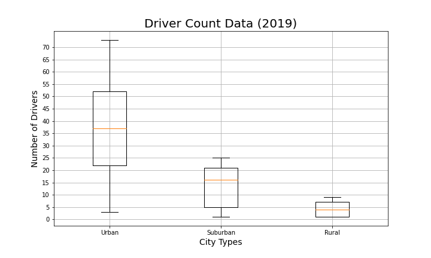

# PyBer_Analysis 
## Overview of PyBer Analysis
The purpose of this project is to analyze all the rideshare data from Pyber, a rideshare company, during January to early May of 2019. The datapoints also include driver ids, ride ids, date of ride, fare amount, city and city type. Based on this data we will aggregate and review information that will produce effective visualizations.
## Results
See below for the results of the rideshare data for the following categories: total rides,total drivers, total fares, average fare per ride and driver, and total fare by city type.
### Rideshare Data

Based on the information gathered from PyBer rideshare data, the city type directly correlates to the total rides, drivers, and fare. Typically, the urban city type has a larger population which would produce more rides and drivers to perform those services. Conversely, the rural city type has the least total rides and drivers and can be attributed to the total population. However, the highest average for the total amount of fare per ride and average per driver was the rural city type. Based on this data we can project that there are fewer rural rides but are more expensive vs. more frequent rides being less expensive for urban rides.

## Summary
Based on the results, there are a few recommendations for the differences between each city type for Pyber. 

1. Include additional data to examine the average fare with the average ride time. Using this information 
